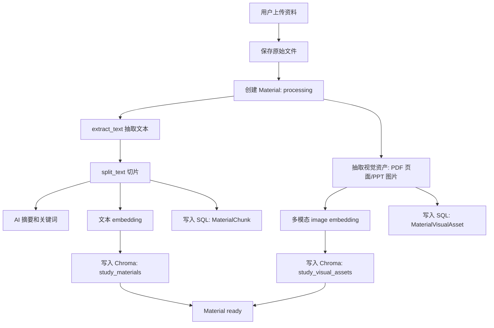
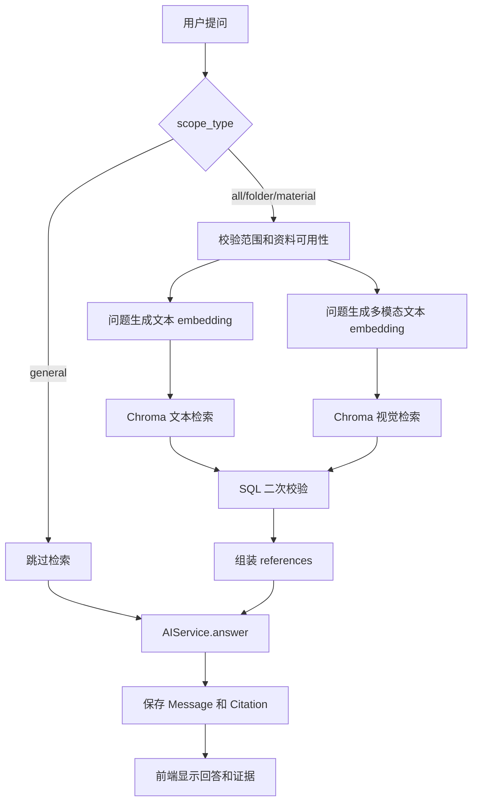

# 当前系统 RAG 实现说明

> 基于 2026-06-27 当前代码阅读整理。本文描述的是项目现在已经实现的 RAG 行为，而不是未来设计稿。

## 1. RAG 在本系统里是什么

RAG 是 Retrieval-Augmented Generation，中文通常叫“检索增强生成”。在这个系统里，它的含义很具体：

1. 用户把学习资料上传到“知识库”。
2. 后端把资料解析成文本，切成小片段。
3. 每个文本片段生成 embedding 向量，写入 Chroma 向量库。
4. PDF 页面图、PPT 图片等视觉资料也会被抽取出来，在配置了多模态 embedding API 时写入另一个 Chroma 集合。
5. 用户在“AI 学习会话”里提问时，系统先根据问题向量去知识库中检索最相关的文本片段和视觉证据。
6. 系统把检索到的证据拼进 prompt，再调用聊天模型生成回答。
7. 回答和引用证据会保存到会话历史，前端可以展示“本次回答依据了哪些资料”。

所以，当前系统的 RAG 不是“把整份文件直接发给大模型”，而是“资料解析、切片、向量化、按范围检索、把证据注入 prompt、保存引用”的一整套流程。

如果用户选择“通用问答”，系统会跳过资料检索，直接调用 AI 模型。这种情况下不是 RAG。

## 2. 代码地图

| 模块 | 作用 |
| --- | --- |
| `backend/routes/materials.py` | 资料上传、资料详情、移动文件夹、删除资料、重建索引、索引状态查询 |
| `backend/services/document_service.py` | 判断支持的文件类型、抽取文本、文本切片 |
| `backend/services/visual_service.py` | 从 PDF 渲染页面图，从 PPTX 抽取图片，并压缩规范化图片 |
| `backend/services/ai_service.py` | 摘要、关键词、文本 embedding、多模态 embedding、最终问答模型调用 |
| `backend/services/rag_service.py` | RAG 核心编排：索引、检索、视觉检索、生成回答、删除索引、同步元数据 |
| `backend/services/vector_store_service.py` | Chroma 持久化向量库封装 |
| `backend/services/scope_service.py` | 校验问答范围：通用、全部资料、文件夹、单资料、未分类 |
| `backend/models/material.py` | 资料、文本切片、视觉资产、重建索引任务的数据模型 |
| `backend/models/chat.py` | 会话、消息、引用证据、旧版问答历史的数据模型 |
| `backend/routes/chat.py` | AI 问答入口、会话消息、重试、历史记录 |
| `frontend/src/views/Chat.vue` | 前端 AI 学习会话页面 |
| `frontend/src/components/study/ScopeSelector.vue` | 前端问答范围选择器 |
| `frontend/src/components/study/EvidencePanel.vue` | 前端引用证据展示 |

## 3. 运行时组成

当前 RAG 依赖四类存储或服务。

| 组件 | 当前用途 |
| --- | --- |
| MySQL 或配置中的 SQL 数据库 | 保存用户、资料元数据、文本切片、视觉资产、会话、引用、重建任务 |
| 本地文件系统 | 保存上传的原始文件和抽取出的图片资产 |
| Chroma | 保存文本向量和视觉向量 |
| 外部 AI API | 生成摘要、关键词、embedding 和最终回答 |

后端启动时会确保 `UPLOAD_FOLDER` 和 `CHROMA_DIR` 目录存在，见 `backend/app.py`。

## 4. 关键配置

配置集中在 `backend/config.py`。

| 配置项 | 默认值或含义 |
| --- | --- |
| `UPLOAD_FOLDER` | 上传文件和视觉资产保存目录，默认 `backend/uploads` |
| `CHROMA_DIR` | Chroma 持久化目录，默认 `backend/chroma_store` |
| `CHAT_BASE_URL`、`CHAT_API_KEY`、`CHAT_MODEL` | 最终聊天模型配置 |
| `CHAT_WIRE_API` | 调用聊天模型的协议，默认 `chat_completions`，也支持 `responses` |
| `TEXT_EMBEDDING_BASE_URL`、`TEXT_EMBEDDING_API_KEY` | 文本 embedding API 配置 |
| `EMBEDDING_MODEL` | 文本 embedding 模型，默认 `text-embedding-3-small` |
| `RAG_TOP_K` | 文本检索返回数量，默认 `5` |
| `TEXT_VECTOR_COLLECTION` | 文本向量集合名，默认 `study_materials` |
| `VISUAL_VECTOR_COLLECTION` | 视觉向量集合名，默认 `study_visual_assets` |
| `MULTIMODAL_RAG_ENABLED` | 是否启用视觉 RAG，默认 `true` |
| `MULTIMODAL_EMBEDDING_URL` | 多模态 embedding 接口，默认 DashScope 多模态 embedding 地址 |
| `MULTIMODAL_EMBEDDING_MODEL` | 多模态 embedding 模型，默认 `qwen3-vl-embedding` |
| `MULTIMODAL_TOP_K` | 视觉检索返回数量，默认 `3` |
| `MAX_VISUAL_ASSETS_PER_MATERIAL` | 单份资料最多抽取多少个视觉资产，默认 `40` |

重要退化行为：

- 如果没有配置聊天模型 API，`AIService` 会使用简单 fallback 文本截断来生成摘要或回答。
- 如果没有配置文本 embedding API，`AIService.embed()` 会使用 hash embedding。本地开发能跑通，但语义检索质量很弱。
- 如果没有配置多模态 embedding API，视觉资产可以被抽取到本地，但不会进入视觉向量库，视觉资产状态会标记为 `failed`。

## 5. 资料上传和索引流程

资料上传入口是：

```text
POST /api/materials/upload
```

对应代码在 `backend/routes/materials.py` 的 `upload_material()` 和 `_process_material()`。

### 5.1 上传前校验

后端会做这些检查：

1. 必须登录，接口使用 JWT。
2. 必须上传文件。
3. 文件扩展名必须在支持列表里。
4. 如果指定了 `folder_id`，该文件夹必须属于当前用户。

支持的资料类型在 `backend/services/document_service.py`：

```text
pdf, doc, docx, txt, md, markdown, pptx, xlsx
```

### 5.2 保存资料记录

上传后，后端会：

1. 生成安全文件名和随机存储名。
2. 把文件保存到 `UPLOAD_FOLDER/{user_id}/`。
3. 创建一条 `Material` 记录。

新资料初始状态大致是：

```text
status = processing
index_state = not_indexed
sync_state = synced
active_index_generation = 0
```

### 5.3 文本抽取

`extract_text(file_path)` 会按扩展名选择解析方式：

| 文件类型 | 抽取方式 |
| --- | --- |
| PDF | `pypdf.PdfReader` 抽取页面文本 |
| DOCX | 优先 `python-docx`，失败时直接读 docx 内部 XML |
| DOC | 依次尝试 Microsoft Word COM、LibreOffice、antiword |
| TXT | 多编码尝试读取，包括 `utf-8-sig`、`utf-8`、`gb18030`、`latin-1` |
| Markdown | 读取文本，并清理代码块、图片链接、普通链接、标题符号等 |
| PPTX | 读取幻灯片 XML 和备注 XML 中的文本 |
| XLSX | 用 `openpyxl` 读取工作表单元格文本 |

### 5.4 文本切片

切片函数是 `split_text(text, chunk_size=900, overlap=120)`。

它的逻辑是：

1. 统一换行符。
2. 按空行拆成段落。
3. 尽量把段落合并到 900 字符以内。
4. 如果某段太长，再按 900 字符切开。
5. 相邻长切片之间保留 120 字符 overlap。

切片的意义是让检索粒度更细。用户问一个小问题时，系统不需要把整份资料发给模型，只需要拿最相关的几个片段。

### 5.5 摘要和关键词

资料处理时会调用：

- `AIService.summarize(text)`
- `AIService.extract_keywords(text)`

摘要写入 `Material.summary`，关键词用逗号拼接后写入 `Material.keywords`。

这部分不是 RAG 检索必须条件，但用于前端知识库展示和资料管理。

### 5.6 文本向量入库

核心代码在 `RAGService.index_material(material, chunks, generation=None)`。

每个 chunk 会生成一个 Chroma id：

```text
user-{user_id}-material-{material_id}-gen-{generation}-chunk-{index}
```

每个 chunk 会保存三份信息：

1. SQL 的 `MaterialChunk` 表：保存 `material_id`、`chunk_index`、`content`、`chroma_id`。
2. Chroma 的文档内容：保存 chunk 原文。
3. Chroma 的 metadata：保存用户、资料、文件夹、generation 等过滤字段。

文本向量 metadata 大致是：

```json
{
  "user_id": 1,
  "folder_id": 2,
  "material_id": 10,
  "generation": 1,
  "chunk_index": 0,
  "title": "数据库讲义",
  "folder_name": "课程资料"
}
```

这里的 `folder_id` 如果为空，会写成 `0`。但普通“未分类”范围当前没有在 `RAGService.answer()` 中真正传入 `folder_id=0` 过滤，后文会专门说明。

### 5.7 视觉资产抽取和入库

视觉处理在文本处理后执行。

`extract_visual_assets(material)` 只处理：

| 文件类型 | 视觉资产 |
| --- | --- |
| PDF | 把每页渲染成 PNG 图片 |
| PPTX | 从 `ppt/media/` 抽取图片 |
| 其他类型 | 不抽取视觉资产 |

PDF 页面图会用 PyMuPDF 渲染，默认 DPI 来自 `PDF_RENDER_DPI`，图片会压缩到配置允许的尺寸和字节数内。

视觉向量入库在 `RAGService.index_visual_assets()`。视觉 Chroma id 格式是：

```text
user-{user_id}-material-{material_id}-gen-{generation}-visual-{index}
```

视觉向量 metadata 大致是：

```json
{
  "type": "image",
  "user_id": 1,
  "folder_id": 2,
  "material_id": 10,
  "generation": 1,
  "asset_index": 0,
  "asset_type": "pdf_page",
  "page_number": 1,
  "title": "数据库讲义",
  "folder_name": "课程资料"
}
```

视觉资产本身会保存到 SQL 的 `MaterialVisualAsset` 表，包括图片路径、caption、页码、状态等。

## 6. 向量库实现

向量库封装在 `backend/services/vector_store_service.py`。

系统使用 Chroma 的持久化客户端：

```python
chromadb.PersistentClient(path=current_app.config["CHROMA_DIR"])
```

当前有两个 collection：

1. 文本资料集合：`study_materials`
2. 视觉资料集合：`study_visual_assets`

封装的方法很薄：

| 方法 | 用途 |
| --- | --- |
| `upsert(ids, documents, embeddings, metadatas)` | 写入或更新向量 |
| `query(embedding, top_k, where)` | 按 query embedding 和 metadata 条件检索 |
| `delete(where)` | 按 metadata 条件删除 |
| `update_metadata_where(where, metadata)` | 读出匹配行，合并 metadata 后重新 upsert |

为了避免 Chroma telemetry 影响运行，代码里设置了多个环境变量，并 monkey patch 了 Posthog capture。

## 7. 问答范围 Scope

前端范围选择在 `ScopeSelector.vue`，后端校验在 `scope_service.py`。

当前前端支持：

| scope_type | 含义 | 是否 RAG |
| --- | --- | --- |
| `general` | 通用问答，不检索资料 | 否 |
| `all` | 当前用户全部已处理资料 | 是 |
| `folder` | 指定文件夹内资料 | 是 |
| `material` | 指定单份资料 | 是 |
| `uncategorized` | 未分类资料 | 设计上应是 RAG，但当前核心回答逻辑没有真正按未分类过滤 |

后端会校验：

- 文件夹必须属于当前用户。
- 单份资料必须属于当前用户。
- 单份资料如果不是 `ready`，且没有可用的 `active_index_generation`，不能用于问答。

## 8. 提问到回答的完整流程

当前主力接口是：

```text
POST /api/chat/conversations/{conversation_id}/messages
```

旧兼容接口仍存在：

```text
POST /api/chat
```

前端 `Chat.vue` 使用的是会话消息接口。

### 8.1 前端发送

用户在 AI 学习会话页面输入问题后，前端会构造：

```json
{
  "content": "用户问题",
  "scope": {
    "scope_type": "all"
  },
  "request_id": "req-..."
}
```

如果选择文件夹：

```json
{
  "scope": {
    "scope_type": "folder",
    "folder_id": 2
  }
}
```

如果选择单资料：

```json
{
  "scope": {
    "scope_type": "material",
    "material_id": 10
  }
}
```

`request_id` 用于幂等。如果同一个请求重复提交，后端会返回已有的用户消息和助手消息。

### 8.2 后端创建消息

`routes/chat.py` 的 `send_conversation_message()` 会：

1. 校验会话属于当前用户且未删除。
2. 校验问题不为空。
3. 校验 `request_id` 是否已经处理过。
4. 校验 scope。
5. 创建一条 user message。
6. 创建一条 assistant message，初始状态是 `generating`。
7. 调用 `_complete_assistant()` 生成答案。

### 8.3 RAGService.answer()

如果 scope 是 `general`，后端直接调用：

```python
AIService().answer(content, [], conversation=...)
```

如果不是 `general`，后端调用：

```python
RAGService().answer(
    user_id=conversation.user_id,
    question=content,
    scope_type=scope.get("scope_type"),
    material_id=scope.get("material_id"),
    folder_id=scope.get("folder_id"),
    conversation=_conversation_context(conversation.id),
)
```

`RAGService.answer()` 会先做范围可用性检查：

| 范围 | 检查 |
| --- | --- |
| `material` | 资料存在，属于当前用户；如果没有 ready 且没有 active generation，则拒绝 |
| `folder` | 文件夹存在，属于当前用户；文件夹内至少有 ready 资料 |
| `uncategorized` | 当前用户至少有未分类 ready 资料 |
| `all` | 当前用户至少有一份 ready 资料 |

然后执行：

1. `search()` 检索文本证据。
2. `search_visual()` 检索视觉证据。
3. 合并 references。
4. 调用 `AIService.answer(question, references, conversation=conversation)`。
5. 返回 `answer, references`。

## 9. 文本检索具体怎么做

文本检索方法是 `RAGService.search()`。

### 9.1 构造 metadata 过滤条件

默认只按当前用户过滤：

```json
{ "user_id": 1 }
```

如果是单资料：

```json
{
  "$and": [
    { "user_id": 1 },
    { "material_id": 10 }
  ]
}
```

如果是文件夹：

```json
{
  "$and": [
    { "user_id": 1 },
    { "folder_id": 2 }
  ]
}
```

### 9.2 生成问题向量

系统调用：

```python
embedding = self.ai.embed(question)
```

`AIService.embed()` 的优先级是：

1. 如果 `EMBEDDING_MODEL == MULTIMODAL_EMBEDDING_MODEL`，用多模态文本 embedding。
2. 如果配置了文本 embedding API，用 `/embeddings` 接口。
3. 否则使用本地 hash embedding。

### 9.3 查询 Chroma

系统调用：

```python
self.vector_store.query(embedding, top_k, where)
```

默认 `top_k` 是 `RAG_TOP_K=5`。

Chroma 返回：

- `documents`：文本片段。
- `metadatas`：片段元数据。
- `distances`：距离。

注意：这里字段名保存为 `score`，但值来自 Chroma 的 `distance`。一般情况下，distance 越小越相似。前端或 `Citation.to_dict()` 中把它显示成“相关度”时，语义并不严格。

### 9.4 SQL 二次校验

Chroma 返回后，系统不会直接信任向量库 metadata，而是再查 SQL：

```python
Material.query.filter_by(id=metadata.get("material_id"), user_id=user_id).first()
```

然后再次确认：

- 资料仍属于当前用户。
- 如果传了 `material_id`，资料 id 必须匹配。
- 如果传了 `folder_id`，资料当前 SQL 中的 folder_id 必须匹配。

这个二次校验很重要，因为资料可能被移动文件夹，Chroma metadata 可能短暂落后。

### 9.5 Chroma 失败时的 fallback

如果 Chroma 查询异常，系统会走 `_fallback_search()`。

fallback 不做向量检索，而是：

1. 从 SQL 的 `MaterialChunk` 取最多 200 个 chunk。
2. 按 material 或 folder 过滤。
3. 把问题按空格分词。
4. 统计每个词在 chunk 中出现次数。
5. 取分数最高的 top_k。

这个 fallback 能保证系统在 Chroma 暂时不可用时仍能返回一些依据，但中文问题没有空格时效果有限。

## 10. 视觉 RAG 具体怎么做

视觉检索方法是 `RAGService.search_visual()`。

前提条件是：

```python
self.ai.multimodal_enabled
```

也就是：

- `MULTIMODAL_RAG_ENABLED=true`
- 配置了 `MULTIMODAL_EMBEDDING_URL`
- 配置了 `MULTIMODAL_EMBEDDING_API_KEY`

视觉检索流程：

1. 用多模态 embedding API 把用户问题转成文本侧多模态向量。
2. 去 `study_visual_assets` 集合中查询 top_k，默认 3。
3. 按 `user_id`、`material_id` 或 `folder_id` 做 metadata 过滤。
4. 用 SQL 查询 `MaterialVisualAsset`，确认视觉资产仍存在且状态为 `ready`。
5. 返回 image 类型 reference。

返回的视觉 reference 包括：

```json
{
  "type": "image",
  "asset_id": 5,
  "material_id": 10,
  "folder_id": 2,
  "folder_name": "课程资料",
  "title": "数据库讲义",
  "asset_type": "pdf_page",
  "asset_index": 0,
  "page_number": 1,
  "caption": "数据库讲义 第 1 页页面图",
  "image_url": "/api/materials/assets/5/image",
  "score": 0.12,
  "generation": 1
}
```

最终回答模型当前没有把图片二进制直接发给聊天模型。它把视觉证据的标题、页码和 caption 拼成文本，注入 prompt。前端引用面板会再通过 `GET /api/materials/assets/{asset_id}/image` 拉取图片并展示。

## 11. 最终 Prompt 怎么构造

最终回答在 `AIService.answer()`。

它会从 references 中取：

- 最多 5 条文本证据。
- 最多 3 条视觉证据。
- 最近最多 8 条会话上下文。

文本证据格式类似：

```text
[文本资料1]
这里是资料片段内容...
```

视觉证据格式类似：

```text
[视觉资料1] 数据库讲义 第1项：数据库讲义 第 1 页页面图
```

系统给模型的核心指令是：

```text
你是个人学习助手。请优先根据提供的学习资料回答用户问题。
如果资料中没有相关内容，请明确说明“资料中未找到直接依据”，再给出通用解释。
```

因此，当前系统允许模型在资料不足时给出通用解释，但要求它先说明资料中没有直接依据。

## 12. 引用证据如何保存和展示

回答生成成功后，`routes/chat.py` 会调用 `_save_citations()`。

每条 reference 会保存成 `Citation`：

| 字段 | 含义 |
| --- | --- |
| `type` | `text` 或 `image` |
| `material_id` | 来源资料 id |
| `material_title_snapshot` | 来源资料标题快照 |
| `folder_id_snapshot` | 来源文件夹 id 快照 |
| `folder_name_snapshot` | 来源文件夹名称快照 |
| `chunk_index` | 文本片段序号 |
| `asset_id` | 视觉资产 id |
| `page_number` | PDF 页码 |
| `caption` | 视觉证据说明 |
| `preview` | 文本片段预览 |
| `score` | Chroma distance 或 fallback 分数 |
| `generation` | 索引 generation |

前端 `EvidencePanel.vue` 会展示：

- 文本证据的资料标题、片段序号、内容预览。
- 视觉证据的资料标题、页码、caption 和图片。

视觉图片不是裸 `` 直接加载，而是通过 `materialApi.assetImage()` 带 JWT 请求，拿到 blob 后生成 Object URL。

## 13. 重建索引机制

重建入口是：

```text
POST /api/materials/{material_id}/reindex
```

状态查询是：

```text
GET /api/materials/{material_id}/index-status
```

重建任务模型是 `ReindexJob`。

### 13.1 为什么有 generation

`Material` 有两个 generation 字段：

| 字段 | 含义 |
| --- | --- |
| `active_index_generation` | 当前可用于问答的索引版本 |
| `building_index_generation` | 正在构建的新索引版本 |

重建索引时，系统会：

1. 计算 `next_generation = active_index_generation + 1`。
2. 把资料标记为 `processing`，`index_state=queued`。
3. 创建 `ReindexJob`。
4. 后台线程执行 `_run_reindex_job()`。

如果旧 generation 已经存在，状态接口会返回：

```json
{
  "ask_ai_available": true,
  "ask_ai_uses_generation": 3
}
```

也就是说，新索引构建期间，用户仍可以用旧索引问答。

### 13.2 重建成功

重建成功后：

```text
active_index_generation = job.generation
building_index_generation = null
index_state = ready
status = ready
job.status = succeeded
job.phase = completed
```

### 13.3 重建失败

如果重建失败：

- 如果原来有旧索引，资料保持 `status=ready`，`index_state=stale`。
- 如果没有旧索引，资料会变成 `failed`。
- job 会记录 `error_code=INDEX_FAILED`，`retryable=true`。

这保证了“重建失败不一定导致原资料完全不可问答”。

### 13.4 服务重启或后台线程中断

如果查询状态时发现 job 是 `queued` 或 `running`，但该 job 不在内存集合 `_ACTIVE_REINDEX_JOBS` 里，系统会把它标记为：

```text
job.status = stale
job.phase = stale_after_restart
job.retryable = true
```

资料则根据是否有旧 active generation 变成 `stale` 或 `failed`。

## 14. 移动资料和索引一致性

资料移动入口是：

```text
PATCH /api/materials/{material_id}/folder
```

移动文件夹会改变 SQL 中的 `Material.folder_id`，也会影响 RAG 的范围过滤。系统因此需要同步 Chroma metadata。

正常流程：

1. 更新 SQL 的 `Material.folder_id`。
2. 更新 SQL 的 `MaterialVisualAsset.folder_id`。
3. 调用 `RAGService.sync_material_folder_metadata(material)`。
4. 同步文本向量集合和视觉向量集合中的 `folder_id`、`folder_name`。
5. 成功后 `sync_state=synced`。

如果 Chroma metadata 同步失败：

```text
sync_state = sync_failed
index_state = stale
```

接口会提示“资料已移动，但索引同步失败，可重建索引修复检索范围”。

同时，文本检索结果会再用 SQL 当前 folder 校验一次，因此即使 Chroma metadata 暂时过期，也能减少跨文件夹误召回。

## 15. 删除资料和删除文件夹

删除资料时：

1. 取消该资料正在排队或运行的重建任务。
2. 删除文本向量。
3. 删除视觉向量。
4. 删除视觉资产文件目录。
5. 删除上传的原始文件。
6. 删除 SQL 资料记录。

删除文件夹时：

1. 文件夹内资料不会被删除。
2. 这些资料会移动到未分类。
3. 这些资料标记为 `sync_state=sync_pending`。
4. 如果资料原本是 ready，则 `index_state=stale`。

注意：删除文件夹时当前代码不会立刻同步 Chroma metadata，而是标记 stale，后续需要重建索引或同步修复。

## 16. 当前实现的完整链路图





## 17. 当前实现的优点

1. **用户隔离明确**：向量 metadata 和 SQL 查询都按 `user_id` 过滤。
2. **支持多种资料类型**：PDF、Word、文本、Markdown、PPTX、XLSX 都能进入文本 RAG。
3. **支持视觉证据**：PDF 页面和 PPT 图片可以作为视觉资产进入单独向量集合。
4. **有引用保存**：回答不是只保存一段文本，还会保存证据快照。
5. **有会话上下文**：回答时会带最近最多 8 条历史消息。
6. **有重建索引任务**：索引可以重新生成，并保留旧 generation 可用性。
7. **Chroma 失败有 fallback**：向量库异常时仍能通过 SQL 文本切片做简单关键词检索。
8. **移动资料考虑一致性**：移动文件夹会同步向量 metadata，失败时标记 stale。

## 18. 当前实现的限制和注意点

### 18.1 未分类 scope 的核心检索过滤不完整

`scope_service.py` 支持 `uncategorized`，`RAGService.answer()` 也检查未分类 ready 数量。但真正检索时：

```python
scoped_folder_id = folder_id if scope_type == "folder" else None
```

这意味着 `uncategorized` 不会传入 `folder_id=0` 或其他过滤条件，最终会退化成类似 `all` 的检索。前端有“未分类”选项，但当前后端核心 RAG 没有真正只检索未分类资料。

### 18.2 hash embedding 只适合开发兜底

没有配置 embedding API 时，系统会使用 `_hash_embedding()`。这可以让流程跑通，但不是语义向量，检索质量不能等同真实 embedding 模型。

### 18.3 Chroma distance 被叫做 score

Chroma 返回的是 `distances`，通常越小越相似。当前系统把它保存为 `score`，`Citation.to_dict()` 还会显示成“相关度 xx%”。这个展示语义可能误导。

### 18.4 最终模型没有直接看图片

视觉 RAG 检索用的是图片 embedding，但最终聊天模型收到的是图片 caption、标题和页码，并没有收到图片内容本身。前端能展示图片证据，但回答生成主要依赖 caption 和检索命中。

### 18.5 上传处理是同步的

首次上传后 `_process_material(material)` 是同步执行的。大文件或外部 API 慢时，上传请求会等待解析、摘要、切片、索引、视觉处理完成后才返回。

重建索引才是后台线程执行。

### 18.6 文本切片按字符数，不按 token 或语义结构

当前切片简单可靠，但不是语义切分。对于结构复杂的讲义、表格或代码，检索片段可能不够自然。

### 18.7 fallback 中文检索较弱

fallback 使用 `question.lower().split()` 分词。中文问题通常没有空格，因此 fallback 可能只得到一个很长的查询词，召回效果有限。

### 18.8 删除旧 generation 的实现较粗

`delete_old_material_generations()` 当前直接调用 `delete_material_vectors()`，会删除该资料全部文本向量，不是按 generation 精细删除。当前主流程主要依赖重建时删除目标 generation 和重新写入，后续如果要做多 generation 保留，需要重新设计清理策略。

## 19. 如何判断一次回答是不是用了 RAG

可以从三个地方看。

### 19.1 前端

AI 学习会话右侧“学习范围与证据”里，如果本次回答有引用，会展示文本片段或视觉证据。

### 19.2 接口响应

会话消息接口返回的 assistant message 中，如果有：

```json
"citations": [...]
```

说明本次回答保存了 RAG 引用。

旧接口 `/api/chat` 返回：

```json
"references": [...]
```

### 19.3 数据库

查看 `citation` 表。如果某条 assistant message 有 citation，就说明回答时保存了证据。

## 20. 常见排查路径

### 20.1 上传后资料不能问答

优先看 `material` 表：

- `status`
- `index_state`
- `error_message`
- `active_index_generation`
- `chunk_count`，可以通过接口返回或关联 `material_chunk` 表查看

如果 `status=failed`，通常是文本抽取失败、没有抽取到可索引文本，或外部 API 失败。

### 20.2 检索不到资料

检查：

1. 资料是否属于当前用户。
2. 资料是否 `status=ready`。
3. `material_chunk` 是否有记录。
4. Chroma 目录是否正确。
5. `TEXT_VECTOR_COLLECTION` 是否和写入时一致。
6. 移动文件夹后 `sync_state` 是否为 `sync_failed` 或 `sync_pending`。

### 20.3 视觉证据不出现

检查：

1. 文件是否 PDF 或 PPTX。
2. 是否安装 PyMuPDF 和 Pillow。
3. `MULTIMODAL_RAG_ENABLED` 是否为 true。
4. 是否配置 `MULTIMODAL_EMBEDDING_API_KEY`。
5. `material_visual_asset.status` 是否为 `ready`。
6. `VISUAL_VECTOR_COLLECTION` 是否正确。

### 20.4 AI 超时或上游失败

会话接口会把 assistant message 标记为：

- `failed_timeout`
- `failed_error`

并设置 `retryable=true`。前端会展示“重试”按钮。

## 21. 一句话总结

当前系统的 RAG 是一个以“个人知识库资料”为来源的检索增强问答系统。它把上传资料解析成文本切片和视觉资产，分别写入 SQL 与 Chroma；用户提问时根据选择的范围检索相关证据，把证据注入 prompt 交给聊天模型回答，并把引用保存到会话历史。它已经具备文本 RAG、视觉证据检索、会话引用、重建索引和资料移动一致性处理，但未分类过滤、score 展示语义、fallback 中文检索和上传异步化仍有明显改进空间。
